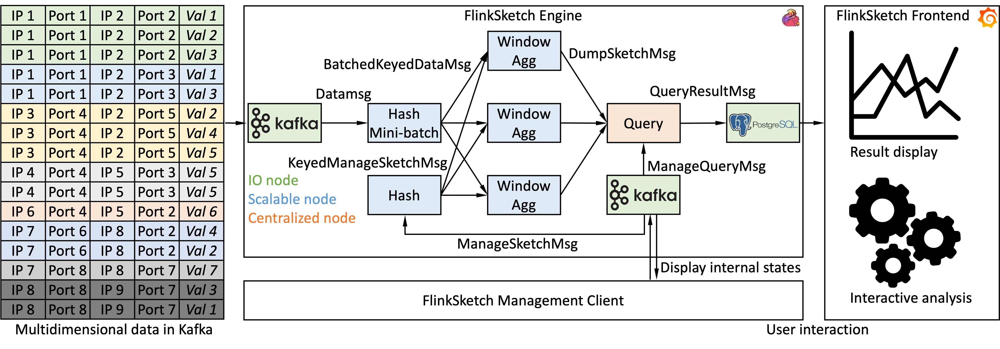

**FlinkSketch - A Sketch Analytical System for Multidimensional Data Streams**\
August 2022 - Present\
[[Will be open-source!]](https://github.com/wateryloo/flinksketch)

- Implemented a sketch analytical system for multidimensional data streams based on Apache Flink.
- Implemented the Sketch-of-sketches mechanism.
- Integrated the universal sketch algorithm.
- Implemented the hashed mini-batch mechanism.
- Fully deployable through common public network services, e.g., Flink, Kafka, PostgreSQL, and Grafana.
- Easy management of sketches and queries with full-duplex client-engine communication.

**Benchmarking Cloud-Native Storage Engines**\
April 2021 - June 2022
- Studied the characteristics of I/O workloads of the cloud-native storage engine at ByteDance.
- Leveraged ML models to predict the characteristics of I/O workloads from the characteristics of compute workloads in the cloud-native database in ByteDance.
- Adapted YCSB to design and implement a learned benchmark to generate realistic I/O workloads.
- Improved the accuracy of the tail-latency measured by benchmark tools by orders of magnitudes.
- **Submitted an industry-track paper as the primary author.**

**Interactive Workflow System Texera**\
June 2021 - September 2021
- Implemented set difference operator and set symmetric difference operator. [[LINK]](https://github.com/Texera/texera/issues/1205)
- Designed and implemented storage backends and a workflow rewriter for operator materialization. [[LINK]](https://github.com/Texera/texera/issues/1257)

**GPU-integrated OLAP System GHive**\
April 2020 - April 2021
- Implemented the prototype of GHive, a GPU-integrated OLAP system based on Apache Hive.
- Designed and implemented operators, dataflow, and data processing logic.
- Implemented low-cost data transfer between JVM and native environment.
- **Published a demo paper in SIGMOD'22 as a co-author.**
- **Published an industry-track paper in SoCC'22 as a co-author.**

For a list of other (course) projects, go [here](/otherprojects).
